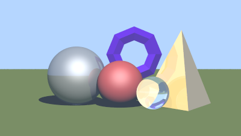
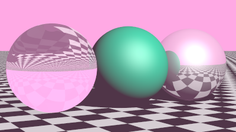
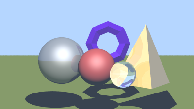
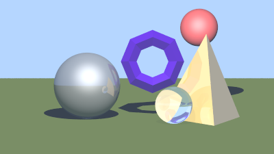
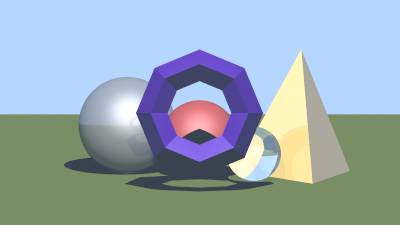
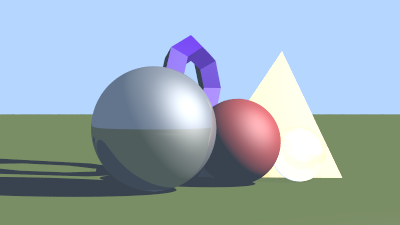
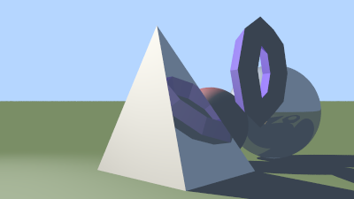
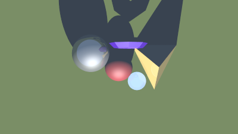
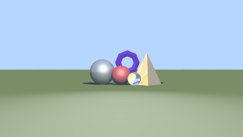

# Projeto Ray-tracing
Implementação do algoritmo de renderização *Ray-tracing*. Para gerar o arquivo PNG da imagem, basta rodar o [script de geração de imagem](gen_image.py) com os argumentos referentes à configuração desejada:

```shell
python3 gen_image.py <opção de compilação> <opção de cena>
```

### Opções de compilação
- Sem otimizações, com avisos (safe): `-s`
- Com otimizações, sem avisos (fast): `-f`

### Opções de cena
- Amostra com todas as features do projeto (sample): `-s`

    

- Estético e com um "aspecto de sonho" (dreamy): `-d`

    

- Lê a cena descrita no [arquivo de entrada](in.txt) (custom): `-c`

### Formato de entrada

- Esfera

    ```
    s cx cy cz r Or Og Ob ri ka kd ks kr kt p
    ```

    - `s`: identificador da esfera
    - `(cx, cy, cz)`: coordenadas do centro da esfera
    - `r`: raio da esfera

- Plano

    ```
    p px py pz vx vy vz Or Og Ob ri ka kd ks kr kt p
    ```

    - `p`: identificador do plano
    - `(px, py, pz)`: coordenadas de um ponto pertencente ao plano
    - `(vx, vy, vz)`: coordenadas do vetor normal ao plano

- Malha

    ```
    t nt nv
    p1x p1y p1z
    p2x p2y p2z
    ...
    pnvx pnvy pnvz
    t1a t1b t1c
    t2a t2b t2c
    ...
    tnta tntb tntc
    Or Og Ob ri ka kd ks kr kt p
    ```

    - `t`: identificador da malha
    - `nt`: número de triângulos
    - `nv`: número de vértices
    - `(pix, piy, piz)`: coordenadas do i-ésimo vértice
    - `(tia, tib, tic)`: índices dos vértices do i-ésimo triângulo

- Atributos das entidades

    - `(Or, Og, Ob)`: cor difusa da entidade
    - `ri`: índice de refração
    - `ka`: coeficiente ambiental
    - `kd`: coeficiente difuso
    - `ks`: coeficiente especular
    - `kr`: coeficiente reflexivo
    - `kt`: coeficiente de transmissão
    - `p`: coeficiente de rugosidade ou expoente de Phong

- Câmera

    ```
    c hres vres vfov upx upy upz Cx Cy Cz Mx My Mz
    ```

    - `c`: identificador da câmera
    - `hres`: resolução horizontal da tela
    - `vres`: resolução vertical da tela
    - `vfov`: campo de visão vertical
    - `(upx, upy, upz)`: coordenadas do vetor pra cima em relação à câmera
    - `(Cx, Cy, Cz)`: coordenadas da câmera (foco)
    - `(Mx, My, Mz)`: coordenadas do ponto para onde a câmera aponta

- Luz

    ```
    l lx ly lz Ilr Ilg Ilb
    ```

    - `l`: identificador da luz
    - `(lx, ly, lz)`: coordenadas da luz
    - `(Ilr, Ilg, Ilb)`: intensidade da luz (cor RGB)

- Ambiente

    ```
    a Iar Iag Iab
    ```

    - `a`: identificador do ambiente
    - `(Iar, Iag, Iab)`: intensidade da cor ambiente (cor RGB)

### Transformações afins
Para aplicar uma transformação afim em uma entidade ou na câmera, é necessário modificar o [arquivo fonte principal](src/main.cpp). Aqui estão algumas demonstrações:

- Transformação no plano

    ```cpp
    scene.get_entity(0)->move(0.0, -0.5, 0.0); // Translação no eixo y
    ```

    

- Transformação na esfera (vermelha)

    ```cpp
    scene.get_entity(1)->move(1.0, 1.0, -2.0); // Translação nos eixos x, y e z
    ```

    

- Transformação na malha (toro)

    ```cpp
    scene.get_entity(5)->move(-0.2, -0.2, 1.5); // Translação nos eixos x, y e z
    ```

    

- Transformação na câmera (vista dianteira esquerda)

    ```cpp
    camera.move(-4.0, 0.0, -3.0); // Translação nos eixos x e z
    camera.h_tilt(-60);          // Rotação horária em torno do eixo z
    ```

    

- Transformação na câmera (vista traseira direita)

    ```cpp
    camera.move(4.0, 0.0, -7.0); // Translação nos eixos x e z
    camera.h_tilt(120);         // Rotação anti-horária em torno do eixo z
    ```

    

- Transformação na câmera (vista do topo)

    ```cpp
    camera.move(0.0, 8.0, -5.0); // Translação nos eixos y e z
    camera.v_tilt(-90);         // Rotação horária em torno do eixo x
    ```

    

- Transformação na câmera (vista distante)

    ```cpp
    camera.move(0.0, 0.0, 7.0); // Translação no eixo z
    ```

    